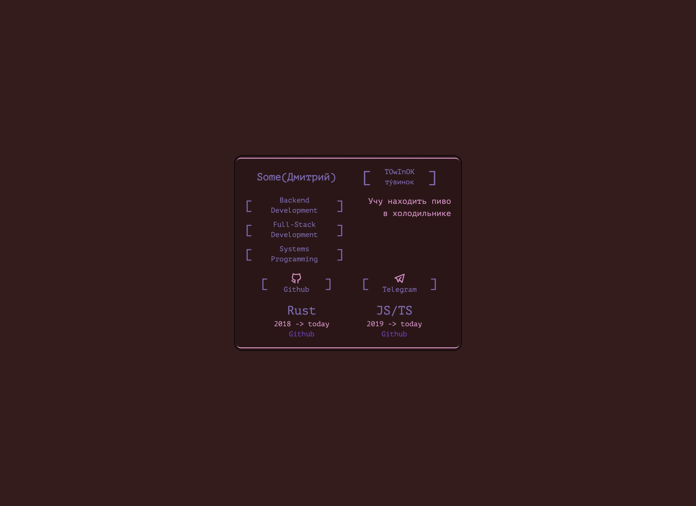

SSS-rs (Skill, Slick, Style) is a library and CLI tool for creating stylish developer cards.

## Available languages README
[RU](README_ru.md) | [EN](README_ru.md)

## Library

### Core Components

1. **Configuration** (`sss-core`)
   - Data structures for developer information

2. **Themes** (`render`, trait `Shade` or structure `Theme`)
   - Customizable color schemes
   - Built-in themes:
     - Umbrella (default)
     - Rosé Pine
     - GrooveBox
     - Dracula

3. **Layouts** (`render`, trait `Layout` + `Finalize`)
   - Tera-based templating system
   - HTML and [TailwindCSS*](https://crates.io/crates/encre-css) support
   - Responsive design

### Library Usage

```rust
use sss_core::Settings;
use sss_std::themes::Themes;
use sss_std::layouts::Layouts;

// Create configuration
let settings = Settings::default();

// Choose theme and layout
let theme = Themes::Umbrella;
let layout = Layouts::Umbrella;

// Generate HTML
let html = layout.to_layout(&settings, &theme.into())
    .finalize()
    .unwrap();
```

# SSS-rs CLI

CLI tool for generating HTML/PNG/PDF using SSS-rs themes and layouts.
Allows you to host generated pages with hot reload for themes and layouts.

## Dependencies
- PNG/PDF
  - chromium/chrome (headless_chrome mode)
    - If you don't have it, these features won't work, but everything else will.

## Usage

```bash
sss_cli [OPTIONS] <COMMAND>
```

### Global Options

- `-c, --config <PATH>` - path to config file (default: config.toml)
- `-t, --theme <THEME>` - theme selection [possible values: umbrella, rose-pine, groove-box, dracula]
- `-l, --layout <LAYOUT>` - layout selection [possible values: umbrella, castle, github]
- `-o, --out <FILE>` - output HTML filename (default: sss-rs.html)
- `--tracing <TRACING>` - Log level [default: info] [possible values: info, trace, debug, error, warn]
- `-h, --help` - print help
- `-V, --version` - print version

### Commands

#### new - Generate new config
```bash
sss_cli new [OPTIONS]

Options:
  -t, --type <TYPE>    Configuration format [default: toml]
                              [possible values: json, toml]
```

#### run - Start development server
```bash
sss_cli run [OPTIONS]

Options:
  -w, --watch               Watch for config changes
  -s, --serve               Start web server
  -a, --address <ADDRESS>   Web server address [default: 0.0.0.0:8081]
```

### Avaiable routes
- Api doc
  - Scalar API Page: /api
- Routes
  - Main card (html) page: /
  - Png card: /png
  - Pdf card: /pdf
  - Json settings of instance: /json
  - Base64 toml config : /share
  - Health check : /health

#### gen - Generate HTML, PNG, PDF
```bash
sss_cli gen [OPTIONS]

Options:
  -t, --type <OUTPUT_TYPE>  output type [default: html] [possible values: html, png, pdf]
  -o, --out <OUTPUT_NAME>   output name [default: sss-rs]
```

### Usage Examples

```bash
# Create new TOML configuration
sss_cli new
# or
# Create JSON configuration
sss_cli new --config-type json

# Start development server with auto-reload
sss_cli run --watch --serve
# or
sss_cli run -w -s

# Additional options

# Generate HTML with custom output file
sss_cli -o portfolio.html gen

# Commands below disable hot reload for applied value
# Generate HTML with theme
sss_cli -t dracula gen

# Generate HTML with layout
sss_cli -l github gen
```

## How to build CLI

```bash
git clone https://github.com/TOwInOK/SSS-rs
cd SSS-rs
cargo build -r -p sss_rs
mv target/release/sss_cli sss-cli
./sss-cli
```

## How to run file downloaded from github on macos
```sh
xattr -rd com.apple.quarantine name_of_file
./name_of_file
```

# SSS-rs Web App

## How to start locally?
[you need to install trunk](https://trunkrs.dev/guide/getting-started/installation.html), then run
```sh
cd sss-web-app
trunk serve --open
```
This command will start the server on port 3000 and open your default browser.


## How to build your own layout

[**Guide**](How_to_construct_layout.md)

- SSS cli
  - At the moment you can't use your own templates directly with cli.
  You can make an [Issue](https://github.com/TOwInOK/SSS-rs/issues/new?template=Blank+issue) for adding them.
- SSS-lib
  - You can create and use your own templates with [HtmlTeraRender](sss-lib/sss-std/src/layouts/html_tera_builder.rs)
  or
  Create your own implementation with traits: [Layout + Finalise](sss-lib/render/src/layout.rs)

## License
[Apache 2.0](LICENSE)

## Contributing
If you want to add a new theme or layout, create an [Issue](https://github.com/TOwInOK/SSS-rs/issues/new?template=Blank+issue)!

# Example

