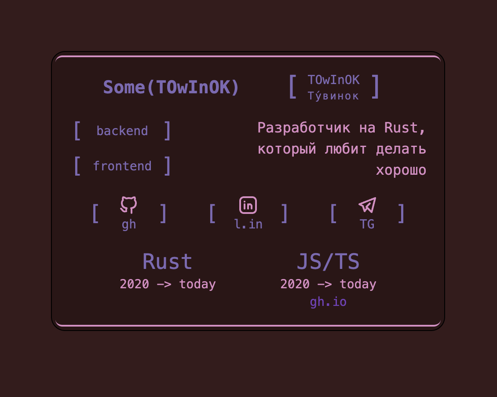

# Under development ⚠️

# Skill, Slick, Style - rs

A tool to present you as a developer with Slick, Shark, Savvy skills and style.

## How it works?

We have 2 components:
1. **Theme** (trait `Shade`)
   - Allows you to get colors necessary for coloring.
2. **Layout** (trait `Render`)
   - Defines how to arrange data from the Config and Colors from Shade.

- Intended to create small cards with brief information about yourself, but no one stops you from creating a full one as well :)

## Progress status

- [x] Lib
  - [x] User config parser
    - [x] Toml
    - [x] Json
  - [x] Render
    - [x] Layouts
      - [x] Umbrella (default)
  - [x] Themes
    - [x] Umbrella
    - [x] Rosé Pine
    - [x] GrooveBox
    - [x] Dracula
  - If you **want** to see more **Themes**, **make an issue!**
- [x] CLI app
  - [x] viewer
  - [x] site generator

## Structure of Theme

default colors use

- `Colors`
  - `primary` -> for text
  - `secondary` -> for background
  - `thirdly` -> for accent
  - `border` -> for any accent elements

## Structure of project

**Note** still under development.

1. parser - config parser
2. render - theme & render traits
3. sss-core - standart structures
4. sss-std - base themes & layouts & tools
5. sss-cli - ultimate cli tool for generating site, creating config

# Example
- Umbrella (card)
  - 
  - [html + css](sss-std/card.html)

# License
[Apache 2.0](LICENSE)
